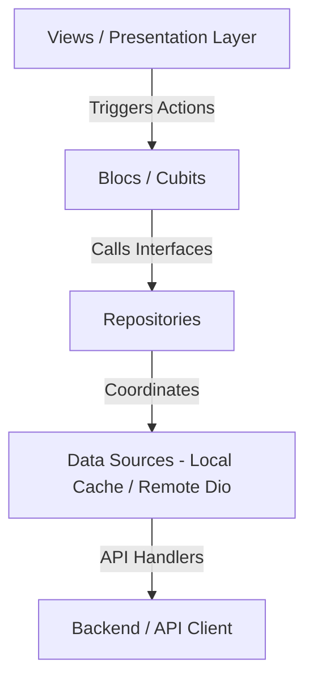

# 💧 Aqua Go — On-Demand Mobile Car Wash & Aqua Services

Aqua Go is a premium, high-performance Flutter mobile application built for on-demand car wash and specialized aqua service bookings. Designed with a stunning, modern dark/light visual identity, the app empowers customers with seamless passwordless logins, interactive map-based address management, multi-vehicle profiles, and a robust booking scheduler.

---

## ✨ Features Breakdown

### 🔐 Modern Authentication & Guest Journey
*   **Passwordless OTP Verification:** Fully integrated OTP authentication via both **Phone** and **Email** to ensure smooth, secure logins.
*   **Seamless Guest Access:** A flexible session architecture allows users to explore the catalog, packages, and offers as guests, prompting registration only when performing critical tasks like reserving a booking.
*   **Secure Token Lifecycles:** Real-time access token renewal utilizing an advanced `RefreshTokenInterceptor` to deliver uninterrupted session longevity.

### 📅 Advanced Service Booking & Quotes
*   **Tailored Services & Packages:** Multi-tiered offerings (Wash, Detailing, Special Treatment) presented via dynamic carousel sliders.
*   **Full Booking Flow:** Interactive multi-step Wizard (Service Select ➡️ Location Map Pinned ➡️ Car Picker ➡️ Dynamic Summary ➡️ Secure Checkout).
*   **Lifecycle Management:** Users can reschedule, cancel, or rate bookings directly, supported by automated complaints/support handling.

### 📍 Interactive Location Pinner
*   **Google Maps Integration:** Precise latitude/longitude pinning with automatic reverse geocoding via standard API helpers.
*   **Custom Addresses:** Save and label multiple coordinates (Home, Office, etc.) for super-fast future bookings.

### 🚗 Vehicle Fleet Profiling
*   **Add & Manage Vehicles:** Dynamic form validating car make, model, color, and license plate.
*   **Catalog Syncing:** Brands and models dynamically fetched relative to the selected make.

### 🔔 Live Alerts & Communications
*   **Smart Notification Inbox:** View read/unread updates regarding booking schedules, promos, and alerts.
*   **Granular Preferences:** Opt-in or opt-out of specific notifications (SMS, Push, Email).
*   **FCM Register/Deregister:** Automated token synchronization for devices.

### 🔌 Seamless Offline Resilience
*   **Real-time Status Banner:** Features a custom `OfflineIndicator` and `ConnectivityCubit` which monitor network connectivity in the background, showing a beautiful, unobtrusive alert if connection drops and restoring smoothly when back online.

### 🎨 State-of-the-Art Visuals & Shimmers
*   **Skeletonizer Loaders:** Replaces boring loading circles with dynamic, content-shaped shimmer skeletons that elevate visual premium feel.
*   **Dual Branding Theme:** Fully dynamic Obsidian Dark (`#0D0D0D` screen background with high-contrast `#16F7FF` Cyan brand highlights) and Slate Light modes built entirely on customized `ThemeExtension` models.

---

## 🎨 Visual Identity & Typography

*   **Primary Brand Color:** Cyan (`#16F7FF` in Dark Mode, `#0095AA` in Light Mode)
*   **Visual Philosophy:** Sleek Glassmorphism, smooth micro-animations, vibrant content states, and polished dark layouts.
*   **Font Family:** `IBM Plex Sans Arabic` (loaded dynamically through Google Fonts) for flawless bilingual reading flow (English & Arabic).
*   **Default Locale:** Arabic (`ar`), with clean toggle configurations to English (`en`).

---

## 🏗️ Architecture & Stack

Aqua Go is engineered using **Clean Architecture** combined with a robust presentation layer driven by **Bloc/Cubit**. This decouples business logic entirely from visual rendering, guaranteeing high testability and maintenance standards.



### Technical Stack & Core Modules

*   **State Management:** `flutter_bloc` & `bloc` for state mapping and predictable events.
*   **Dependency Injection (DI):** `get_it` service locator registered dynamically during startup (`initServiceLocator()`).
*   **Network Client:** Custom wrapper around `dio` optimized with `TalkerDioLogger` and secure authentication interceptors.
*   **Local Storage:** Combined `shared_preferences` (for user profiles, local caching of the `/me` endpoint, language) and secure database storage.
*   **Internationalization (i18n):** Powered by `easy_localization` utilizing asset JSON translation maps and codegen keys.

---

## 📂 Project Organization

```text
lib/
├── app.dart             # App widget initialization, theme definitions, routing entry
├── main.dart            # Root initialization (DI, Locales, Cache, Bloc Observer)
├── core/                # Core system configurations
│   ├── components/      # Global shared widgets (OfflineIndicator, custom shimmers)
│   ├── config/          # Network layer, Bloc observers, GetIt service locators, Storage client
│   ├── constants.dart   # Global constant keys and configuration values
│   ├── enums/           # System-wide enums (PaymentMethods, BookingStatus)
│   ├── extensions/      # Core helper extensions on context, themes, and formats
│   ├── route/           # AppRouter and navigation route definitions
│   └── themes/          # AppColors, custom theme extensions (light & dark)
└── features/            # Feature-driven slices
    ├── address/         # Location pinners, Google Map helpers, Saved coordinates
    ├── auth/            # Phone/Email OTP, login flow, token management
    ├── booking/         # Multi-step booking wizard and state managers
    ├── home/            # Customer dashboard, banners, catalog services
    ├── layout/          # Core app shells & tab navigation
    ├── my_bookings/     # Booking list history, ratings, and complaints
    ├── my_cars/         # Fleet vehicle profiles
    ├── notifications/   # Preferences, inbox count, and FCM tokens
    ├── profile/         # Account settings, dynamic policy documents, Support
    └── startup/         # Slash screen & interactive onboarding views
```

---

## 🚀 Getting Started

### Prerequisites
1.  **Flutter SDK** (Version `>=3.11.4`)
2.  An active mobile device or emulator configured for Google Maps services.

### Installation

1.  **Clone the Repository:**
    ```bash
    git clone <repository_url>
    cd aqua_go
    ```

2.  **Install Dependencies:**
    ```bash
    flutter pub get
    ```

3.  **Generate Dynamic Localization Keys:**
    To compile the JSON assets into accessible key structures, execute the following from the project root:
    ```bash
    # Generate localization loader files
    dart run easy_localization:generate --source-dir ./assets/translations

    # Compile locale keys g.dart
    dart run easy_localization:generate --source-dir ./assets/translations -f keys -o locale_keys.g.dart
    ```

4.  **Run the Application:**
    ```bash
    flutter run
    ```

---

## 🛠️ Essential Commands & Development Workflows

*   **Generating Assets / Icons:**
    The application launcher icon is configured inside `pubspec.yaml` via `flutter_launcher_icons`. To rebuild launcher icons:
    ```bash
    dart run flutter_launcher_icons
    ```

*   **Running Code Quality Linting:**
    Ensure rules in `analysis_options.yaml` match correctly before committing:
    ```bash
    flutter analyze
    ```

*   **Testing Core Features:**
    Run automated widget/unit tests across the modules:
    ```bash
    flutter test
    ```
